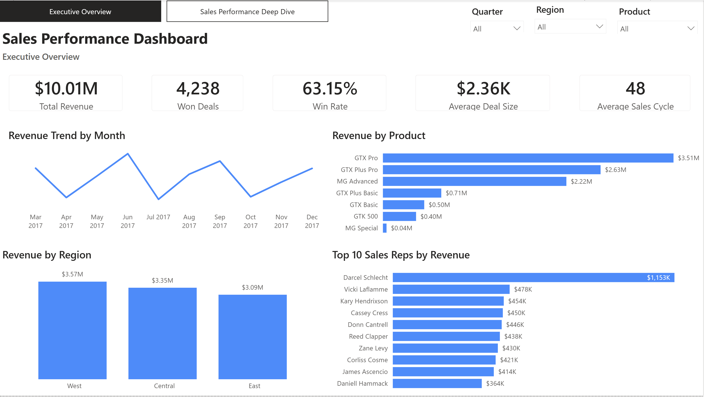

# Sales Performance Dashboard | Power BI

## Project Overview

This Power BI project analyzes B2B sales performance for a fictional computer hardware company.

The dashboard was designed to help sales leadership monitor revenue, deal conversion, product performance, regional results, sales-team effectiveness, sales-cycle efficiency, and key customer accounts.

The project demonstrates an end-to-end BI workflow including data cleaning, relational data modeling, DAX calculations, interactive dashboard design, and business analysis.

---

## Dashboard Preview

### Executive Overview

### Sales Performance Deep Dive

---

## Business Questions

The dashboard was designed to answer questions such as:

- How much revenue has the sales organization generated?
- What percentage of closed opportunities are won?
- Which products generate the most revenue?
- Which regions perform best?
- Who are the highest-performing sales representatives?
- How does win rate vary across sales managers?
- Which products take the longest to close?
- Which customer accounts generate the most revenue?
- How many opportunities are Won, Lost, Engaging, or Prospecting?

---

## Dataset

The project uses the **CRM Sales Opportunities** dataset from Maven Analytics.

The data model includes:

- `sales_pipeline.csv` — 8,800 sales opportunities
- `accounts.csv` — customer account information
- `products.csv` — product catalog and list prices
- `sales_teams.csv` — sales agents, managers, and regions
- `data_dictionary.csv` — field definitions

During data preparation in Power Query, data-quality issues were corrected, including:

- `GTXPro` → `GTX Pro`
- `technolgy` → `technology`
- Date and numeric data types were standardized
- Valid blank values for open opportunities were preserved

---

## Data Model

The report uses a star-schema design with `sales_pipeline` as the central fact table.

Relationships include:

- `accounts[account]` → `sales_pipeline[account]`
- `products[product]` → `sales_pipeline[product]`
- `sales_teams[sales_agent]` → `sales_pipeline[sales_agent]`
- `Date[Date]` → `sales_pipeline[close_date]` — active relationship
- `Date[Date]` → `sales_pipeline[engage_date]` — inactive relationship

The inactive engagement-date relationship is activated in DAX using `USERELATIONSHIP()` when opportunity-entry analysis is required.

---

## Key KPIs

| KPI | Result |
|---|---:|
| Total Revenue | **$10.01M** |
| Total Opportunities | **8,800** |
| Won Deals | **4,238** |
| Lost Deals | **2,473** |
| Open Opportunities | **2,089** |
| Win Rate | **63.15%** |
| Average Deal Size | **$2.36K** |
| Average Sales Cycle | **48 days** |

Win Rate is calculated as:

**Won Deals ÷ Closed Deals**

This excludes opportunities that are still open.

---

## Dashboard Pages

### 1. Executive Overview

The Executive Overview provides leadership with a high-level view of sales performance through:

- Revenue trend by month
- Revenue by product
- Revenue by region
- Top 10 sales representatives by revenue
- KPI cards for revenue, won deals, win rate, average deal size, and average sales cycle
- Interactive Quarter, Region, and Product slicers

### 2. Sales Performance Deep Dive

The second page provides more detailed operational analysis through:

- Opportunities by deal stage
- Win rate by sales manager
- Average sales cycle by product
- Top 10 customer accounts by revenue
- Region, Product, and Manager slicers

The report also includes synchronized slicers and page-navigation controls.

---

## Key Insights

- **GTX Pro** is the highest-revenue product at approximately **$3.51M**.
- The **West region** leads revenue at approximately **$3.57M**, followed closely by Central and East.
- **Darcel Schlecht** is the highest-revenue sales representative at approximately **$1.15M**, substantially ahead of the next-ranked representative.
- **Kan-code** is the highest-revenue customer account at approximately **$341K**.
- Manager win rates are relatively consistent, ranging from approximately **62.1% to 64.4%**.
- **GTK 500** has the longest average sales cycle at approximately **54 days**.
- Overall pricing on won deals is close to product list pricing, with total price variance of approximately **-0.18%**.

---

## Power BI Skills Demonstrated

- Power Query data cleaning and transformation
- Star-schema data modeling
- One-to-many relationships
- Active and inactive date relationships
- Dedicated Date table
- DAX measures
- `CALCULATE`
- `DIVIDE`
- `AVERAGEX`
- `DATEDIFF`
- `FILTER`
- `RELATED`
- `USERELATIONSHIP`
- KPI design
- Top N filtering
- Interactive slicers
- Slicer synchronization
- Cross-filtering
- Page navigation
- Dashboard layout and data storytelling

---

## Project Files

- [`dashboard/Sales_Performance_Dashboard.pbix`](dashboard/Sales_Performance_Dashboard.pbix) — Power BI report
- [`images/executive_overview.png`](images/executive_overview.png) — Executive Overview screenshot
- [`images/sales_performance_deep_dive.png`](images/sales_performance_deep_dive.png) — Sales Performance Deep Dive screenshot
- `data/` — Source CSV files and data dictionary

---

## How to Explore the Dashboard

The interactive Power BI `.pbix` file is included in this repository and can be opened with **Power BI Desktop**.

A public Power BI Service URL is not currently available, so the dashboard screenshots above provide a portfolio preview of the completed report.

---

## Tools Used

**Power BI Desktop | Power Query | DAX | GitHub**

---

## Author

**Germain Gbemou**

Business Intelligence / Data Analytics Portfolio
